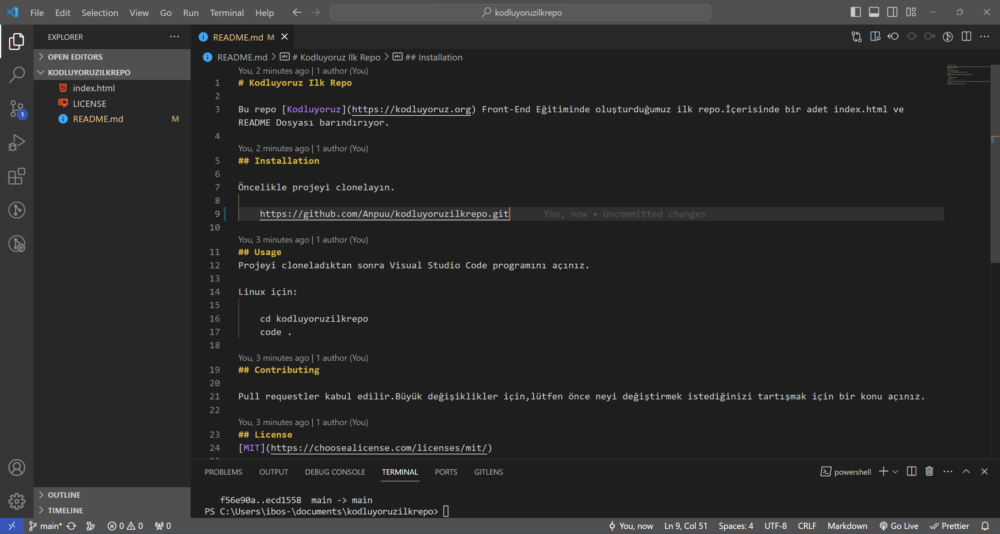

# Kodluyoruz Ilk Repo

Bu repo [Kodluyoruz](https://kodluyoruz.org) Front-End Eğitiminde oluşturduğumuz ilk repo.İçerisinde bir adet index.html ve README Dosyası barındırıyor.

## Installation 

Öncelikle projeyi clonelayın.

	https://github.com/Anpuu/kodluyoruzilkrepo.git

## Usage
Projeyi cloneladıktan sonra Visual Studio Code programını açınız.

Linux için:

	cd kodluyoruzilkrepo
    code .

## Contributing

Pull requestler kabul edilir.Büyük değişiklikler için,lütfen önce neyi değiştirmek istediğinizi tartışmak için bir konu açınız.

## License 
[MIT](https://choosealicense.com/licenses/mit/)
